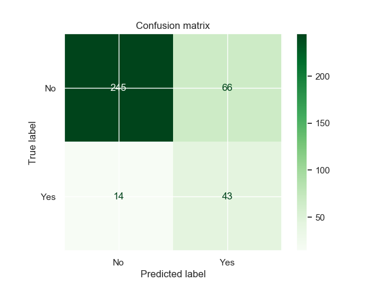
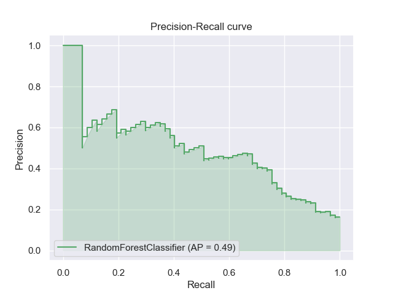
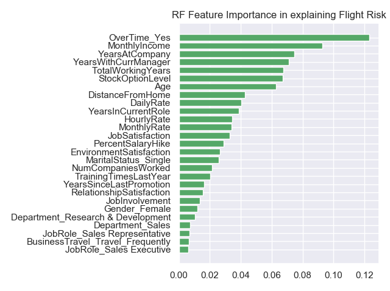

# CEBD-1160: Employee Attrition

| Name | Date |
|:-------|:---------------|
|Daniel Goyer|March 28, 2020|

-----

### Resources
Your repository should include the following:

- Python script for your analysis: `Employee-Flight-Risk_Analyis.py`
- Results figure/saved file: `plots/`
- runtime-instructions in a file named RUNME.md
-----

## Research Question

<b>What are the most important factors predicting employee flight (attrition)?</b>

### Abstract

Predicting employee flight (also known as Attrition or Churn) is a principal concern of Human 
Resource departments as it is typically very costly to replace employees. According to 
[this article](https://www.peoplekeep.com/blog/bid/312123/employee-retention-the-real-cost-of-losing-an-employee), 
the average cost to replace an employee is <i>"20 percent of annual salary for midrange positions 
(earning $30,000 to $50,000 a year). For example, the cost to replace a $40k manager would be 
$8,000."</i> according to one study. Using the dataset which has fictional employee data along with 
attrition I attempted to determine which factors can help predict employee flight. I found it very 
challenging as the data is significantly imbalanced (only 16% of employees left) and also has quite
a few features (49 columns once processed). The model produced was able to provide which factors are
 most likely to predict attrition but the performance was not up to the challenge but has potential 
 if more sophisticated methods are used to treat the imbalance.

### Introduction

This is a fictional dataset created by IBM Data Scientists found on can be found on 
[Kaggle](https://www.kaggle.com/pavansubhasht/ibm-hr-analytics-attrition-dataset). 
It holds 1470 employee records with various HR factors such as compensation, Demographics, 
Measures of environmental satisfaction, performance, work experience, and more along with whether 
the employee left the company or not.

### Methods

After exploring some other algorithms, I decided to use scikit-learn RandomForestClassifer for two
reasons, 1) it provided a way to choose features that were important in prediction, and 2) it had a 
method of predicting not only the outcome itself (attrition or no attrition) but also the 
probability which is more useful as a model for HR departments to monitor risk dynamically.

The scikit-learn documentation on the Random Forest algorithm can be found
[here](https://scikit-learn.org/stable/modules/ensemble.html#random-forests).
Basically, Random Forests create many (in this case 120) Decision Trees by a method called 
*bagging*, which involves taking the original training dataset of size n and randomly sampling 
some part of the data of size n' *with replacement* and then repeating this m times creating 
m different train sets. This has the effect of reducing the variance associated with any one 
Decision Tree and consequently avoids over-fitting. An additional source of randomness involves 
selecting only a random subset of features when creating any one decision node of each Decision Tree
 which is an example of a broader class of techniques called **ensemble learning**.

### Results
I chose the metric of F-Beta with Beta = 1.75 as I wanted to weigh recall as more important than 
precision or any other metric since in an HR context, the cost of a false negative is much higher 
than a false positive.

Applying the model to the test set, it achieved F-Beta = 0.616 and Recall = 0.754 (of all employees 
who did leave in the test set, the model predicted 75.4% correctly). The lower F-Beta is a 
reflection of precision = 0.39. We can see this in the confusion matrix below where of 95 true 
positives, the model incorrectly predicted 59 of them to be negatives.

Another way to visualize the performance is looking at the trade off in Recall vs Precision:

We can see average precision is only 49% and the curve is quite low.

That being said, the model did provide which features are most important in predicting attrition 
with OverTime, MonthlyIncome and TotalWorkingYears being the most important.

### Discussion
The model performed somewhat poorly as there is a low precision. This is due to a couple things:

1. **High Imbalance** - Although I set the weights to be balanced when training the model, it still 
seems the imbalance is reducing performance. We may be able to get better results by treating the 
imbalance with some more advanced techniques like Under-sampling or Over-sampling, and trying 
different Penalization approaches. *(source=5 below)*
2. **Large number of features** - I did attempt to reduce the features using the random forest 
feature importances but it did not seem to impact performance too much. More advanced techniques 
for dimensionality reduction include PCA, ICA, Backward and Forward Elimination, and more. 
*(source=4 below)*

### References
[1. Kaggle dataset](https://www.kaggle.com/pavansubhasht/ibm-hr-analytics-attrition-dataset)

[2. scikit-learn RandomForestClassifer User Guide](https://scikit-learn.org/stable/modules/ensemble.html#random-forests)

[3. Wikipedia Artical on Random Forest Bagging](https://en.wikipedia.org/wiki/Random_forest#Bagging)

[4. Article on Dimensionality Reduction](https://www.analyticsvidhya.com/blog/2018/08/dimensionality-reduction-techniques-python/)

[5. Article on Imbalanced Classes](https://machinelearningmastery.com/tactics-to-combat-imbalanced-classes-in-your-machine-learning-dataset/)

-------
